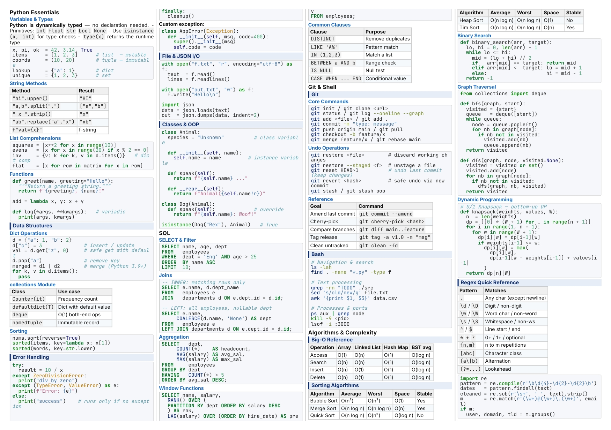

# markdown2cheatsheet

将 Markdown 笔记转换为高密度、可打印的 cheatsheet：A4 横向、4 栏排版、小字号但保持可读，并通过浏览器导出 PDF。

[English README](../README.md)

## 效果预览



## 功能特点

- A4 横向 4 栏高密度排版，适合复习资料、速查表和课程笔记。
- 通过 Pandoc 生成自包含 HTML，样式和资源会被嵌入输出文件。
- 对标题、列表、表格、引用、行内代码和代码块做了小字号打印优化。
- 使用 `postprocess.py` 修复 Pandoc 生成 HTML 中的表格列宽、代码缩进和多栏包裹问题。
- 支持 macOS、Linux，以及 Windows 的 Git Bash / PowerShell 工作流。

## 依赖

| 工具 | 用途 | 安装方式 |
| --- | --- | --- |
| [Pandoc](https://pandoc.org) | Markdown 转 HTML | macOS: `brew install pandoc` · Ubuntu: `sudo apt install pandoc` · Windows: `winget install JohnMacFarlane.Pandoc` |
| Python 3 | 运行 HTML 后处理脚本 | macOS/Linux 通常自带；Windows 可从 [python.org](https://python.org) 安装 |

## 快速开始

```bash
bash md2cheatsheet.sh 你的笔记.md
```

默认会把 `你的笔记.md` 输出为 `你的笔记.html`。

指定输出路径：

```bash
bash md2cheatsheet.sh 你的笔记.md output.html
```

运行仓库内示例：

```bash
bash md2cheatsheet.sh examples/test_cheatsheet.md examples/test_cheatsheet.html
```

## 导出 PDF

1. 用现代浏览器打开生成的 `.html` 文件。
2. 按 `Ctrl+P`，macOS 使用 `Cmd+P`。
3. 设置纸张为 `A4`，方向为 `Landscape` 或“横向”，边距为 `Minimum` 或“最小”。
4. 取消勾选页眉页脚。
5. 保存为 PDF。

## 仓库结构

```text
markdown2cheatsheet/
├── README.md                    # 英文项目说明和使用文档
├── LICENSE                      # MIT 许可证
├── .gitignore                   # Git 忽略规则
├── md2cheatsheet.sh             # 主转换脚本
├── postprocess.py               # Pandoc HTML 后处理脚本
├── cheatsheet.css               # 会嵌入输出 HTML 的打印样式
├── outputview.jpg               # README 效果预览图
├── docs/
│   └── README_CN.md             # 中文文档
└── examples/
    ├── test_cheatsheet.md       # 示例 Markdown 输入
    ├── test_cheatsheet.html     # 示例 HTML 输出
    └── test_cheatsheet.pdf      # 示例 PDF 输出
```

## Markdown 支持

| Markdown | 输出样式 |
| --- | --- |
| `# 一级标题` | 大章节标题 |
| `## 二级标题` | 彩色小节块 |
| `### 三级标题` | 紧凑条目标题 |
| `**加粗**` / `*斜体*` | 加粗和强调样式 |
| `` `行内代码` `` | 紧凑等宽代码块 |
| 围栏代码块 | 语法高亮并自动换行 |
| `> 引用` | 左边框引用块 |
| `==高亮==` | 通过 Pandoc `mark` 扩展生成黄色高亮 |
| 表格 | 紧凑、按内容自适应列宽 |

## 调整排版

主要布局参数都在 `cheatsheet.css` 中。

| 参数 | 默认值 | CSS 规则 |
| --- | --- | --- |
| 栏数 | 4 | `.content-wrapper { column-count: 4 }` |
| 页面 | A4 横向 | `@page { size: A4 landscape }` |
| 页边距 | 5 mm | `@page { margin: 5mm }` |
| 正文字号 | 6.5 pt | `html { font-size: 6.5pt }` |
| 代码字号 | 5.3 pt | `pre { font-size: 5.3pt }` |
| 栏间距 | 2.5 mm | `.content-wrapper { column-gap: 2.5mm }` |

如果想减少栏数、放大字号或增加留白，直接调整这些值即可。

## 工作原理

```text
Markdown 文件
    |
    v
Pandoc
    - Markdown 扩展
    - 语法高亮
    - standalone HTML
    - 嵌入样式和资源
    |
    v
postprocess.py
    - 删除 Pandoc 表格 colgroup 宽度覆盖
    - 压缩代码块行首缩进
    - 用 .content-wrapper 包裹 body 内容
    |
    v
自包含 cheatsheet HTML
    |
    v
浏览器打印 -> PDF
```

## Windows 说明

主脚本需要 Bash。Windows 推荐使用 Git Bash：

```bash
bash md2cheatsheet.sh 你的笔记.md
```

如果通过 `winget` 安装 Pandoc，脚本会自动探测常见安装目录。如果仍然找不到 Pandoc，可以手动加入 `PATH`：

```bash
export PATH="$PATH:/c/Users/$USERNAME/AppData/Local/Pandoc"
```

PowerShell 用户也可以手动运行等价命令：

```powershell
$env:PATH += ";$env:LOCALAPPDATA\Pandoc"

pandoc 你的笔记.md `
  --from markdown+mark+smart+pipe_tables+fenced_code_blocks `
  --to html5 --standalone --embed-resources `
  --css cheatsheet.css --metadata title="cheatsheet" `
  --highlight-style pygments `
  --output tmp_raw.html

python postprocess.py tmp_raw.html output.html
```

## 许可证

MIT。详见 [LICENSE](../LICENSE)。
